#### These procedure steps will be followed on the simulator

1. Open the simulation of alkalinity of water and click on the arrow mark shown at the bottom right corner.  
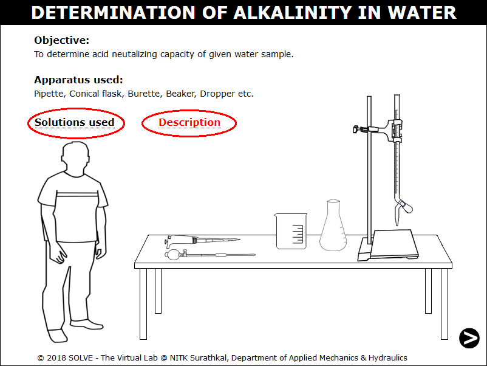 

2. Click on the funnel to place it on the burette. 
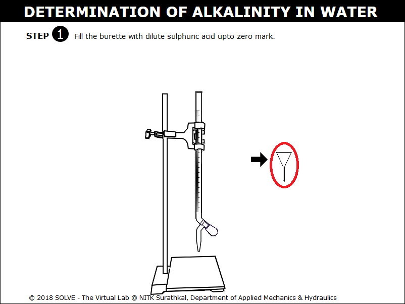 

3. Click on the lid to open and click on the bottle to pour dilute sulphuric acid on to the burette up to zero mark. 
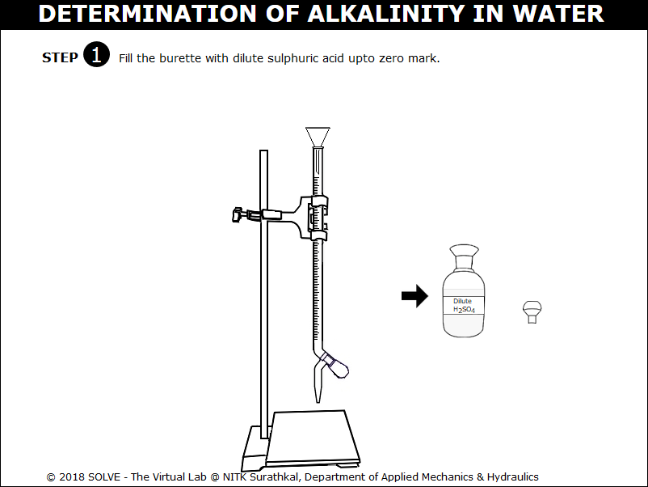 

4. Remove the funnel by clicking on it. Click on the NEXT button once the funnel is removed.  
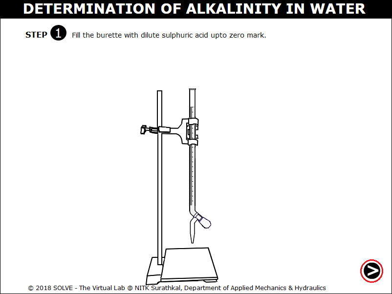 

5. Squeeze the pipette bulb by clicking on it and press the up arrow to take the Na2CO3 solution up into the pipette. 
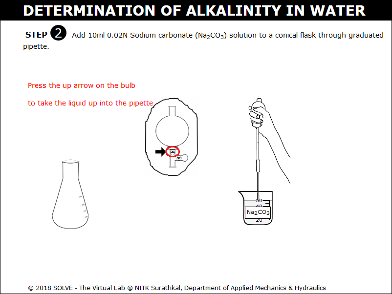 

6. Press the down arrow on the pipette bulb to release liquid into the conical flask.  
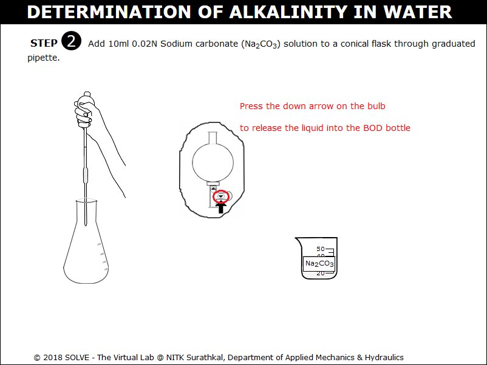 

7. Note the addition of 10ml 0.02N Sodium carbonate solution to conical flask. Click on NEXT button. 
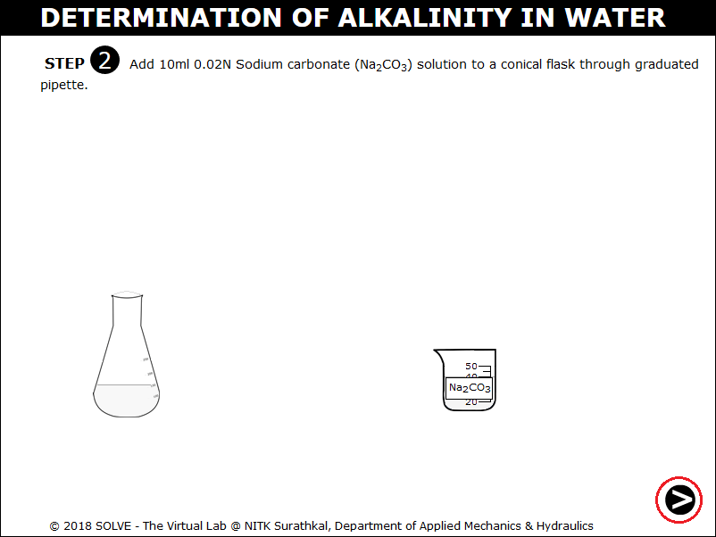 

8. Click on the dropper to add methyl orange indicator to the conical flask.  
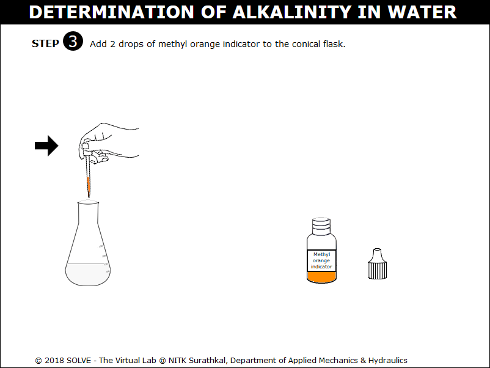 

9. After the addition observe the change in colour of the solution, then click on the NEXT button. 
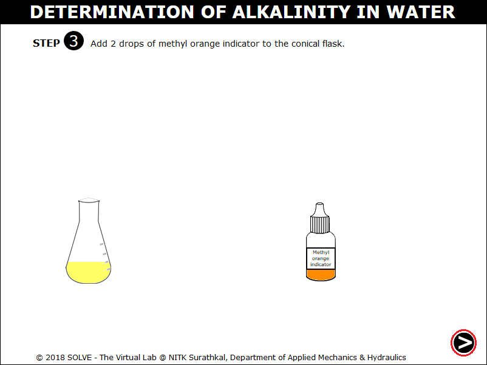 

10. Click on the knob to add the dilute sulphuric acid into the conical flask. 
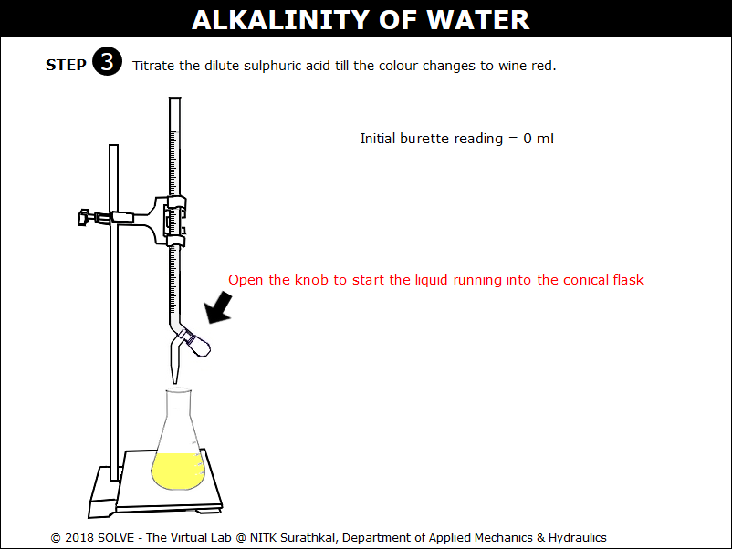 

11. Observe the colour change of the solution in the conical flask to wine red. Click on the NEXT button. 
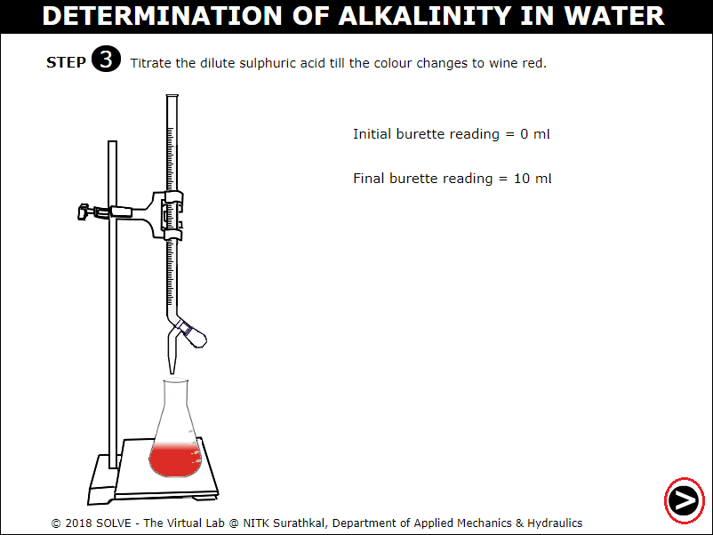 

12. Calculate Normality of Sulphuric acid using the formula and enter the value then click on CHECK button to check the result. 
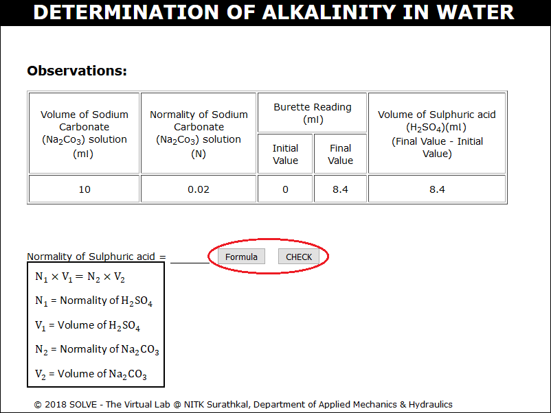 

13. Repeat the same procedure for the 100ml of water sample and note down the observation. Calculate the alkalinity of water using the formula and enter the value then click on CHECK to check the result. 
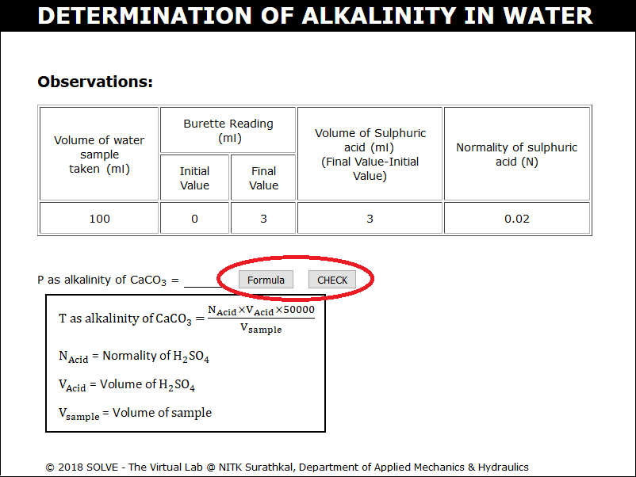 
